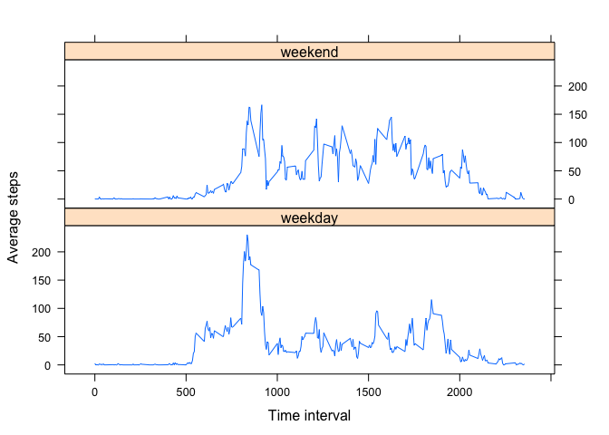

# Reproducible Research: Peer Assessment 1


**Loading and preprocessing the data**

The first step was to download and unzip dataset file 'activity.csv', and put 
it into an object called 'rawdata'.


```r
rawdata <- read.csv("activity.csv")
```
Did a bit of exploratory work on the rawdata file and found that the 'steps' column had 15,264 valid values (53 days x 288 five-minute intervals per day), and that the other columns had 17,568 valid values, which is equal to the number of rows in the 'rawdata' object. 

Will ignore the missing values and will extract only the rows with valid data into an object valid_data, and will analyze this table of data to get the mean and median number of steps.

**What is the mean number of steps per day?**

1. Make a histogram of the total number of steps taken each day.


```r
# Table below contains only those observations that included a value for steps taken
valid_data <- rawdata[!is.na(rawdata$steps),]
rownames(valid_data) <- NULL

# Will ensure that date values are of type character
valid_data$date <- as.character(valid_data$date)

# Now use sapply and split to create a list of total steps by day and follow with a barplot.
daily.steps <- sapply(split(valid_data$steps,valid_data$date),sum)

barplot(daily.steps , xlab="Dates", ylab="Steps", col="blue", main="Total steps by day")
```

 


```r
# Mean and median daily steps steps with rows with NA values removed
meansteps <- mean(daily.steps)
mediansteps <- median(daily.steps)
paste("The mean number of steps per day is ",round(meansteps,digits=2), ", and the median is ",mediansteps,".",sep="")
```

```
## [1] "The mean number of steps per day is 10766.19, and the median is 10765."
```

**What is the average daily activity pattern?**

The data is measured during five-minute intervals throughout the day, so there were 288 unique sampling periods (24 hours x 12 five-minute periods per hour).

1. Make a time series plot (i.e. type = "l") of the 5-minute interval (x-axis) and the average number of steps taken, averaged across all days (y-axis)

```r
# Will use sapply and split to creates mean number of steps and total steps for each five-minute time interval.

interval.means  <- sapply(split(valid_data$steps,valid_data$interval),mean)
interval.totals <- sapply(split(valid_data$steps,valid_data$interval),sum)

# Will create a plot of the means of the intervals, where  the x-axis of five minute intervals are given by the unique values in valid_data$interval

x.axis <- sort(unique(valid_data$interval)) 

plot(x.axis,interval.means,type="l", main="Average steps for each time interval",xlab="Time interval",ylab="Average steps")
```

 

2. Which 5-minute interval, on average across all the days in the dataset, contains the maximum number of steps?

```r
paste("The maximum number of steps,",max(interval.totals), ", occurs during five-minute interval starting at",names(which.max(interval.totals)),sep=" ")
```

```
## [1] "The maximum number of steps, 10927 , occurs during five-minute interval starting at 835"
```

**Imputing missing values**

Note that there are a number of days/intervals where there are missing values (coded as NA). The presence of missing days may introduce bias into some calculations or summaries of the data.

1. Calculate and report the total number of missing values in the dataset (i.e. the total number of rows with NAs)


```r
# Print out number of elements in the 'steps', 'date', and 'interval' columns that have NA values

paste("In this dataset, there are ",sum(is.na( rawdata$steps))," 'NA' values in the 'steps' column ", sum(is.na(rawdata$date))," 'NA' values in the 'date' column, and ", sum(is.na( rawdata$interval))," 'NA' values in the 'inteval' column",sep="")
```

```
## [1] "In this dataset, there are 2304 'NA' values in the 'steps' column 0 'NA' values in the 'date' column, and 0 'NA' values in the 'inteval' column"
```

2. Devise a strategy for filling in all of the missing values in the dataset. 

Since only the 'steps' column has NA values, the strategy for dealing these missing values will be replace them with the value of the mean number of steps for the five-minunte interval associated with that row.

3. Create a new dataset that is equal to the original dataset but with the missing data filled in.


```r
# Will use mean steps per interval (from interval.means object of class 'by') created earlier to replace missing values. Will first create a data frame object means.df with time intervals and mean steps for each interval
means.df <-cbind(as.numeric(names(interval.means)),interval.means)
means.df <- as.data.frame(means.df, row.names=FALSE)
colnames(means.df) <- c("interval.id","interval.means")

# Will now ceate a new object based on original activity data
filled_data <- rawdata

# The 'steps' column from filled_data table (vector filled_data$steps) has  NA values that will be updated by the appropriate 'interval.means' value from the means.df table. 

# The following loop checks replaces any NA value with the mean value of the appropriate five-mintue interval (with a common interval value) from the means.df table

 for (i in 1:nrow(filled_data)){
 if(is.na(filled_data$steps[i])){ filled_data$steps[i] <- means.df[means.df$interval.id==filled_data$interval[i],2]}
} # End of loop
```


4. Make a histogram of the total number of steps taken each day and calculate and report the mean and median total number of steps taken per day. Do these values differ from the estimates from the first part of the assignment? What is the impact of imputing missing data on the estimates of the total daily number of steps?


```r
# Will compute a histogram daily steps for database with replaced NA values (filled_data)

# First, ensure that date values are of type character
filled_data$date <- as.character(filled_data$date)

# Now use sapply and split to create a list of total steps by day and a barplot
daily.steps.filled <- sapply(split(filled_data$steps,filled_data$date),sum)

barplot(daily.steps.filled , xlab="Dates", ylab="Steps", col="red", main="Total steps by day using estitmated NA data")
```

 

```r
# Mean and median daily steps steps with rows with NA values updated with mean number of steps for the associated time interval 
meansteps.filled <- mean(daily.steps.filled)
mediansteps.filled <- median(daily.steps.filled)
paste("The mean number of steps per day for the dataset with estimated values is ",round(meansteps.filled, digits=2), ", and the median is ", round(mediansteps.filled, digits=2),".",sep="")
```

```
## [1] "The mean number of steps per day for the dataset with estimated values is 10766.19, and the median is 10766.19."
```

```r
paste("The differences between the the two datasets (daily.steps - daily.steps.filled)  are mean difference equals ",round(meansteps-meansteps.filled, digits=2), ", and the median differnce equals ",round(mediansteps-mediansteps.filled, digits=2),".",sep="")
```

```
## [1] "The differences between the the two datasets (daily.steps - daily.steps.filled)  are mean difference equals 0, and the median differnce equals -1.19."
```

**Are there differences in activity patterns between weekdays and weekends?**

For this part the weekdays() function may be of some help here. Use the dataset with the filled-in missing values for this part.

1. Create a new factor variable in the dataset with two levels – “weekday” and “weekend” indicating whether a given date is a weekday or weekend day.


```r
# Since the date columns for filled_data are of type character, will convert to type 'Date' 

filled_data$date <- as.Date(filled_data$date, format = "%Y-%m-%d")

# Now will create factor variable that will identify a date as being either on the weekday or weekend, and will add that column of factors to the appropriate data frame

daytype.filled <- weekdays(filled_data$date)=="Saturday"|weekdays(filled_data$date)=="Sunday"
daytype.filled.f <- factor(daytype.filled, labels = c("weekday", "weekend"))
filled_data$daytype <- daytype.filled.f
```

2. Make a panel plot containing a time series plot (i.e. type = "l") of the 5-minute interval (x-axis) and the average number of steps taken, averaged across all weekday days or weekend days (y-axis). 


```r
# Will use the lattice plotting system to create the panel plot

library(lattice)
# Will first split the filled_data database into weekend and weekday then combine them into a singe data set

filled_data_weekday <- filled_data[filled_data$daytype=="weekday",]
filled_data_weekend <- filled_data[filled_data$daytype=="weekend",]
# Will use sapply and split to creates mean number of steps and total steps for each five-minute time interval

interval.means.weekday  <- sapply(split(filled_data_weekday$steps,filled_data_weekday$interval),mean)
interval.means.weekend  <- sapply(split(filled_data_weekend$steps,filled_data_weekend$interval),mean)

# Now will create a data frame for the panel plots, using the same x-axis (the 288 different interval times) as in the earlier plot that did not split the weekday and weekend data.

mean.daytype.df <- data.frame(interval=c(x.axis, x.axis),
                              interval.means=c(interval.means.weekday,interval.means.weekend),
                              daytype=c(rep("weekday", times=length(interval.means.weekday)),
                                        rep("weekend", times=length(interval.means.weekend))))
                   
# The plot below uses lattice, using the daytype factor to compare weekday and weekend data
xyplot(interval.means ~ interval| daytype, data=mean.daytype.df,  
       layout = c(1, 2), type="l", xlab="Time interval", ylab="Average steps")
```

 
